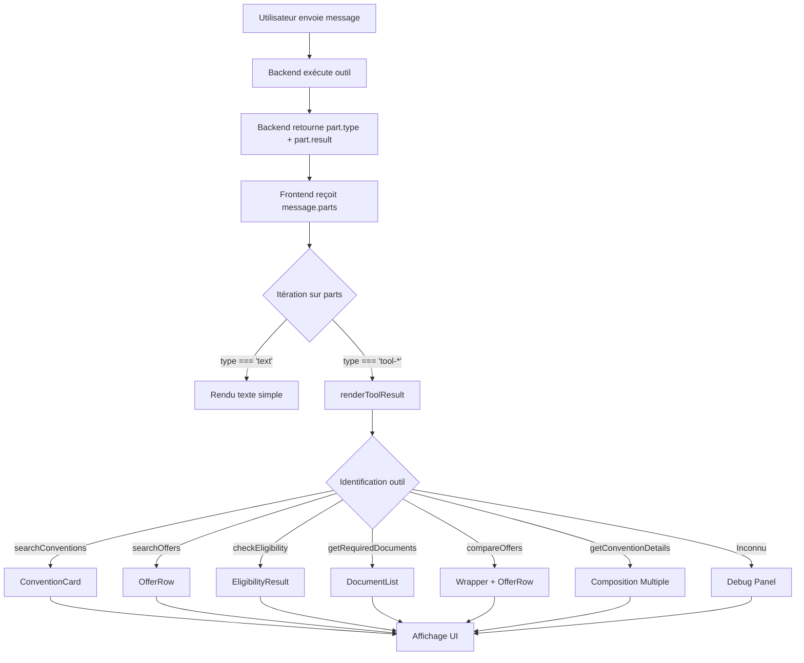

# 📐 Architecture de Rendu des Tool Results

## Vue d'Ensemble

Ce document explique comment l'application gère le rendu structuré des résultats d'outils IA, en évitant que l'IA ne décrive les données en texte simple et en affichant à la place des composants React riches et formatés.

---

## 🏗️ Architecture en 3 Couches

### 1️⃣ Backend : Résultats Structurés

Lorsque l'IA exécute un outil, le backend renvoie le résultat au frontend sous forme de **partie structurée** du message de l'assistant.

**Format du Message** :
```typescript
{
  id: "msg-123",
  role: "assistant",
  parts: [
    {
      type: "text",
      text: "Voici les offres disponibles :"
    },
    {
      type: "tool-searchOffers",  // ← Type spécifique de l'outil
      result: {                    // ← Données JSON structurées
        offers: [...],
        relaxed: false
      }
    }
  ]
}
```

**Types d'Outils Supportés** :
- `tool-searchConventions` - Recherche de conventions
- `tool-checkEligibility` - Vérification d'éligibilité
- `tool-searchOffers` - Recherche d'offres
- `tool-getRequiredDocuments` - Documents requis
- `tool-compareOffers` - Comparaison d'offres
- `tool-getConventionDetails` - Détails d'une convention

---

### 2️⃣ Frontend : Fonction de Rendu Principale

**Localisation** : [`app/page.tsx`](file:///c:/Users/DIGIX/Desktop/forsa-test-folder/app/page.tsx) - Ligne 29

La fonction `renderToolResult` est le **cœur du système de rendu**.

**Responsabilités** :
1. ✅ Itérer sur `message.parts`
2. ✅ Identifier le type d'outil via `part.type`
3. ✅ Intercepter le JSON de `part.result`
4. ✅ Passer les données aux composants UI dédiés

**Code Principal** :
```tsx
{messages.map(message => (
  <ChatMessage key={message.id} role={message.role}>
    {message.parts.map((part, i) => {
      // Rendu du texte simple
      if (part.type === 'text') {
        return <div>{part.text}</div>;
      }
      
      // Rendu des tool results avec composants dédiés
      return renderToolResult(part, message.id, i);
    })}
  </ChatMessage>
))}
```

---

### 3️⃣ Composants UI : Rendu Visuel

Chaque type de données a son **composant React dédié** qui prend le JSON structuré et le rend visuellement.

---

## 🎨 Mapping Outils → Composants

### `tool-searchConventions` → ConventionCard

**Fichier** : [`components/chat/convention-card.tsx`](file:///c:/Users/DIGIX/Desktop/forsa-test-folder/components/chat/convention-card.tsx)

**Données Reçues** :
```typescript
{
  conventions: [
    {
      convention_id: "S",
      partner_name: "Établissement S",
      aliases: ["S", "Etab S"],
      client_type: "B2C",
      eligibility: { active: true, retired: false, family: true },
      offers_count: 5
    }
  ]
}
```

**Rendu** :
```tsx
{part.result.conventions.map((conv: any, idx: number) => (
  <ConventionCard key={`${key}-conv-${idx}`} data={conv} />
))}
```

**Affichage** :
- Nom du partenaire
- ID de convention
- Type de client (B2C/B2B)
- Éligibilité (Actifs, Retraités, Famille)
- Nombre d'offres disponibles

---

### `tool-checkEligibility` → EligibilityResult

**Fichier** : [`components/chat/eligibility-result.tsx`](file:///c:/Users/DIGIX/Desktop/forsa-test-folder/components/chat/eligibility-result.tsx)

**Données Reçues** :
```typescript
{
  eligible: true,
  reasons: ["Vous êtes un employé actif", "La convention couvre votre profil"],
  convention_name: "Établissement S"
}
```

**Rendu** :
```tsx
<EligibilityResult data={part.result} />
```

**Affichage** :
- Icône ✓ ou ✗
- Statut "Éligible" ou "Non éligible"
- Liste des raisons
- Nom de la convention

---

### `tool-searchOffers` → OfferRow

**Fichier** : [`components/chat/offer-row.tsx`](file:///c:/Users/DIGIX/Desktop/forsa-test-folder/components/chat/offer-row.tsx)

**Données Reçues** :
```typescript
{
  offers: [
    {
      offer: {
        category: "Internet",
        technology: "Fibre",
        speed_mbps: 100,
        price_convention_da: 1500,
        price_public_da: 2000,
        discount: "25%"
      },
      partner_name: "Établissement S",
      convention_id: "S"
    }
  ],
  relaxed: false,
  relaxedCriteria: []
}
```

**Rendu** :
```tsx
{part.result.offers.map((item: any, idx: number) => (
  <OfferRow 
    key={`${key}-offer-${idx}`} 
    offer={item.offer}
    partnerName={item.partner_name}
    conventionId={item.convention_id}
  />
))}
```

**Affichage** :
- Catégorie et technologie
- Vitesse (Mbps) ou plan
- Prix convention vs prix public
- Réduction en pourcentage
- Nom du partenaire

**Fonctionnalité Spéciale** : Affichage d'un avertissement si les critères ont été élargis :
```tsx
{part.result.relaxed && (
  <div className="warning">
    ⚠️ Critères de recherche élargis :
    <ul>{part.result.relaxedCriteria.map(...)}</ul>
  </div>
)}
```

---

### `tool-getRequiredDocuments` → DocumentList

**Fichier** : [`components/chat/document-list.tsx`](file:///c:/Users/DIGIX/Desktop/forsa-test-folder/components/chat/document-list.tsx)

**Données Reçues** :
```typescript
{
  documents: [
    "Attestation de travail",
    "Pièce d'identité",
    "Justificatif de domicile"
  ],
  partner_name: "Établissement S",
  notes: "Les documents doivent être récents (moins de 3 mois)"
}
```

**Rendu** :
```tsx
<DocumentList 
  documents={part.result.documents}
  partnerName={part.result.partner_name}
  notes={part.result.notes}
/>
```

**Affichage** :
- Liste à puces avec icône ✓
- Nom du partenaire
- Notes additionnelles en italique

---

### `tool-compareOffers` → Wrapper + OfferRow

**Données Reçues** :
```typescript
{
  comparison: [
    {
      offer: {...},
      partner_name: "Établissement S",
      convention_id: "S",
      savings: 500,
      savingsPercent: "25%"
    },
    {
      offer: {...},
      partner_name: "Établissement L",
      convention_id: "L",
      savings: 300,
      savingsPercent: "15%"
    }
  ]
}
```

**Rendu** :
```tsx
<div className="comparison-container">
  <h4>📊 Comparaison des offres</h4>
  {part.result.comparison.map((item: any, idx: number) => (
    <div key={idx}>
      <OfferRow {...item} />
      {item.savings && (
        <p>💰 Économie : {item.savings} DA ({item.savingsPercent})</p>
      )}
    </div>
  ))}
</div>
```

**Affichage** :
- Titre "Comparaison des offres"
- Chaque offre avec OfferRow
- Économies calculées pour chaque offre

---

### `tool-getConventionDetails` → Composition Multiple

**Données Reçues** :
```typescript
{
  convention: {
    convention_id: "S",
    partner_name: "Établissement S",
    documents: [...],
    offers: [...],
    notes: "..."
  }
}
```

**Rendu** :
```tsx
<div>
  <ConventionCard data={conv} />
  {conv.documents && <DocumentList documents={conv.documents} />}
  {conv.offers && (
    <div>
      <h4>Offres disponibles :</h4>
      {conv.offers.map(offer => <OfferRow offer={offer} />)}
    </div>
  )}
</div>
```

**Affichage** :
- Card de la convention
- Liste des documents (si disponibles)
- Liste des offres (si disponibles)

---

## 🛡️ Gestion des Erreurs

### Fallback pour Outils Inconnus

Si un outil n'est pas reconnu, un debug panel s'affiche :

```tsx
if (part.type.startsWith('tool-')) {
  return (
    <details>
      <summary>Debug: {part.type}</summary>
      <pre>{JSON.stringify(part, null, 2)}</pre>
    </details>
  );
}
```

**Avantages** :
- ✅ Pas de crash si un nouvel outil est ajouté
- ✅ Développeurs peuvent voir les données brutes
- ✅ Facile de débugger les problèmes

---

## 🔄 Flux de Données Complet



---

## ✅ Avantages de Cette Architecture

1. **Séparation des Responsabilités**
   - Backend : Logique métier et données
   - Frontend : Présentation et UX
   - Composants : Rendu visuel spécialisé

2. **Maintenabilité**
   - Chaque outil a son composant dédié
   - Facile d'ajouter de nouveaux outils
   - Code modulaire et testable

3. **Expérience Utilisateur**
   - Données formatées visuellement
   - Pas de texte brut difficile à lire
   - Interface cohérente et professionnelle

4. **Extensibilité**
   - Ajout de nouveaux outils simple
   - Fallback automatique pour outils inconnus
   - Composants réutilisables

---

## 🚀 Ajouter un Nouvel Outil

### Étape 1 : Créer le Composant UI

```tsx
// components/chat/mon-nouveau-composant.tsx
export function MonNouveauComposant({ data }: { data: any }) {
  return (
    <div className="...">
      {/* Votre rendu personnalisé */}
    </div>
  );
}
```

### Étape 2 : Importer dans page.tsx

```tsx
import { MonNouveauComposant } from '@/components/chat/mon-nouveau-composant';
```

### Étape 3 : Ajouter le Cas dans renderToolResult

```tsx
// Dans renderToolResult
if (part.type === 'tool-monNouvelOutil' && part.result) {
  return (
    <div key={key} className="my-3">
      <MonNouveauComposant data={part.result} />
    </div>
  );
}
```

### Étape 4 : Backend Renvoie le Bon Format

```typescript
{
  type: "tool-monNouvelOutil",
  result: {
    // Vos données structurées
  }
}
```

---

## 📊 Résumé

| Élément | Responsabilité | Localisation |
|---------|---------------|--------------|
| **Backend** | Exécuter outils, retourner JSON structuré | API Routes |
| **renderToolResult** | Router les données vers les bons composants | `app/page.tsx:29` |
| **ConventionCard** | Afficher les conventions | `components/chat/convention-card.tsx` |
| **OfferRow** | Afficher les offres | `components/chat/offer-row.tsx` |
| **DocumentList** | Afficher les documents | `components/chat/document-list.tsx` |
| **EligibilityResult** | Afficher l'éligibilité | `components/chat/eligibility-result.tsx` |

---

## ✨ Conclusion

Votre architecture est **parfaitement structurée** et suit les meilleures pratiques :

- ✅ Données structurées du backend
- ✅ Fonction de rendu centrale qui route intelligemment
- ✅ Composants UI dédiés pour chaque type de données
- ✅ Pas de description textuelle - affichage visuel natif
- ✅ Extensible et maintenable

Cette architecture garantit que l'IA ne décrit jamais les données en texte simple, mais les affiche toujours via des composants React riches et formatés !
